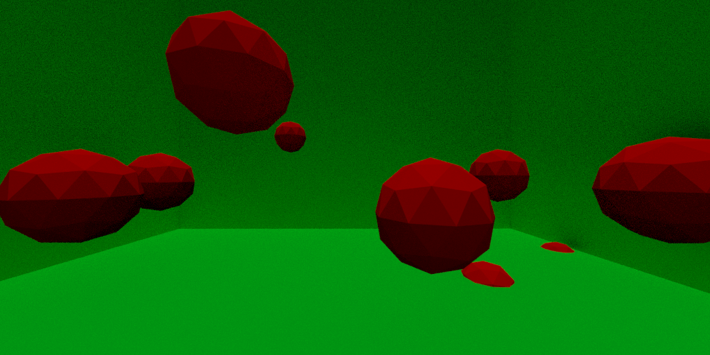
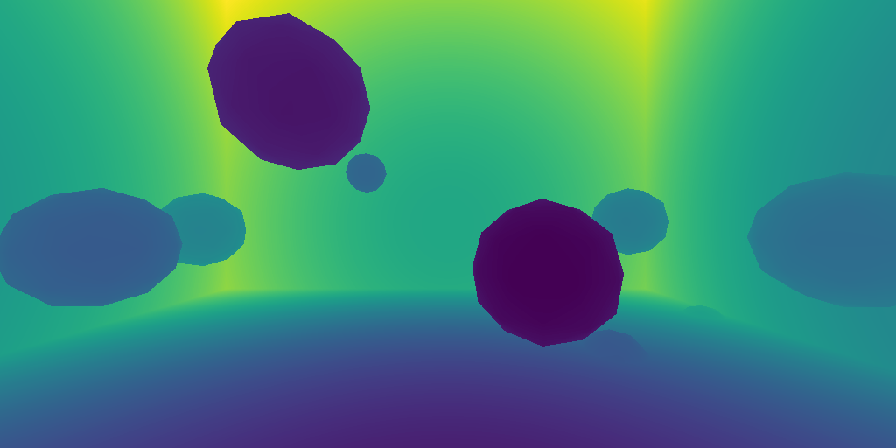

# Synthetic data generator using Blender #

Repo to generate synthetic data using Blender to train object detection, instance segmentation
and depth mapping algorithms. 

  




## Getting Started
You will need [Docker](https://docs.docker.com/install/). 
First, clone this repo
```
git clone https://github.com/thomashossler/synthetic-data-generator.git```
cd synthetic-data-generator
```

Second, build the docker image
```
docker build -t synthetic-data-generator .
```
Then run (careful, the dataset will be created at LOCAL on your host machine):
```
docker run -v /LOCAL/:/data/ -ti synthetic-data-generator  
```

## Config file
The config file should be modified before running the docker container. 


## Download a blender model 
**not ready yet!**

You can either create or download a blender file containing the model. A lot of free stuff exist
online (for example [here](https://www.turbosquid.com/Search/3D-Models/free/blend)) but you will have


## PROGRESS ##
* ~~Write Dockerfile for a blender deep learning environment~~
* Write Python API to generate synthetic data for object detection
* Write Python API to generate synthetic data for object segmentation
* GPU support for faster rendering 
* user able to load any blender model
* Add parameters in the config file

## Authors ##

* **Thomas Hossler** - [thomashossler](https://github.com/thomashossler)
